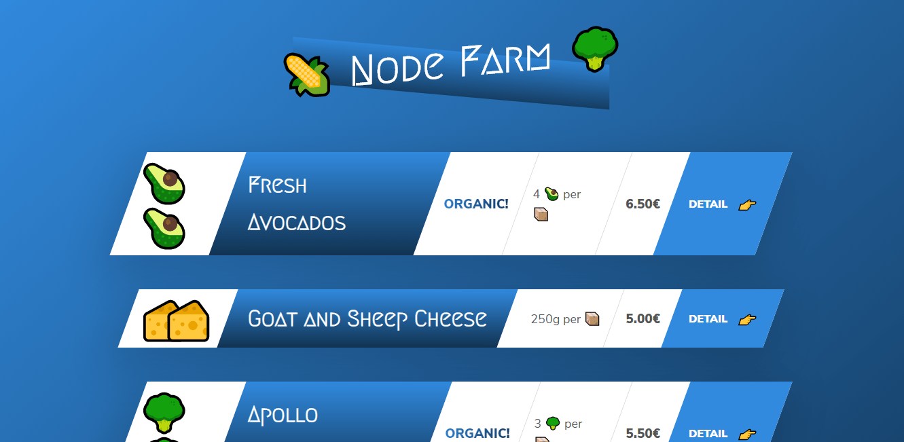

# Node Farm

A very simple API to understand Node.js and NPM basics.

    

## Features

- using core modules, third-party modules and our own modules.
- reading and writing files with fs.
- building a basic server with http.createServer and handling routes.
- building templates and parsing variables from URLs.
- creating nice URLs with slugify.

Based on [Node.js, Express, MongoDB & More: The Complete Bootcamp](https://www.udemy.com/course/nodejs-express-mongodb-bootcamp/) by Jonas Schmedtmann (2019).
