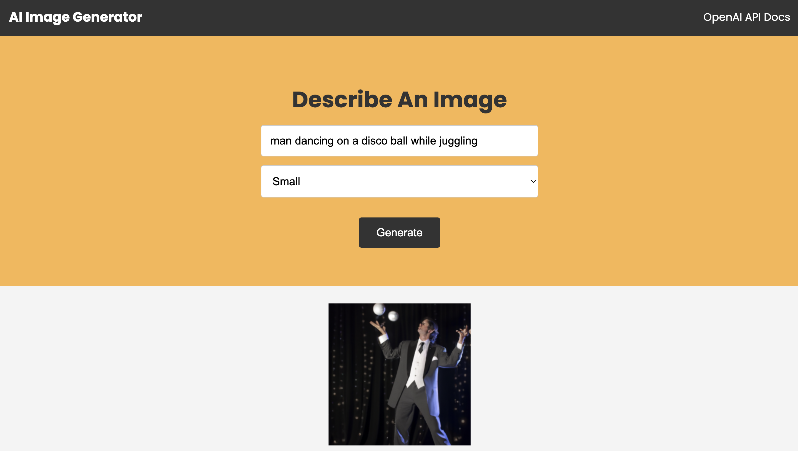

# AI Image Generator

A web app that generates images from scratch based on the entered text, using OpenAI and the DALL-E model.

    

## Features

- setting up and installing dependencies.
- creating an Express server and adding env variables.
- defining a route and a controller.
- using OpenAI library.
- requesting body data.
- setting up a basic frontend.
- generating an image based on user input.
- displaying image in DOM.

Based on [Build An AI Image Generator With OpenAI & Node.js](https://www.youtube.com/watch?v=fU4o_BKaUZE) by Brad Traversy (2022).
