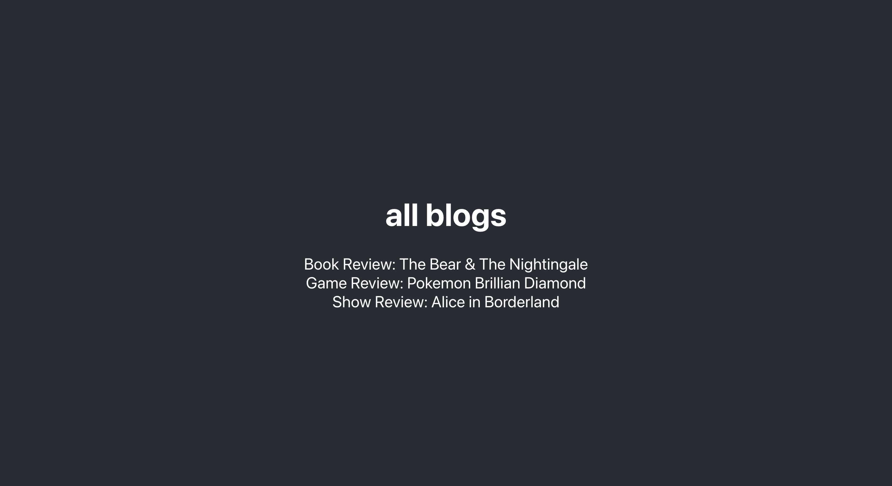

# Docker MERN App

A quick intro to learn how to dockerize a MERN app.

    

## Features

- installing Docker.
- finding a parent image on Docker Hub.
- creating a dockerfile.
- running `docker build -t myapp:v1 .`.
- adding a dockerignore file.
- retrieving images with `docker images`.
- retrieving containers with `docker ps -a`.
- starting a container with `docker run --name myapp_c1 -p 4000:4000 -d myapp:v1` and `docker start myapp_c1`.
- stopping a container with `docker ps` and `docker stop myapp_c1`.
- caching layers to reduce build time.
- deleting containers with `docker container rm myapp_c1`.
- deleting images with `docker image rm myapp`.
- resetting Docker with `docker system prune -a`.
- using volumes to enable live preview in development mode with `npm i` in local folder and `docker run --name myapp_c_nodemon -p 4000:4000 --rm -v /absolute-local-path/api:/app -v /app/node_modules myapp:nodemon`.
- creating images with `docker compose up`.
- stopping and deleting with `docker compose down --rmi all -v`.
- dockerizing a React app.
- sharing an image on Docker Hub.

Based on [Docker Crash Course](https://www.youtube.com/playlist?list=PL4cUxeGkcC9hxjeEtdHFNYMtCpjNBm3h7) by Shaun Pelling - The Net Ninja (2022).
